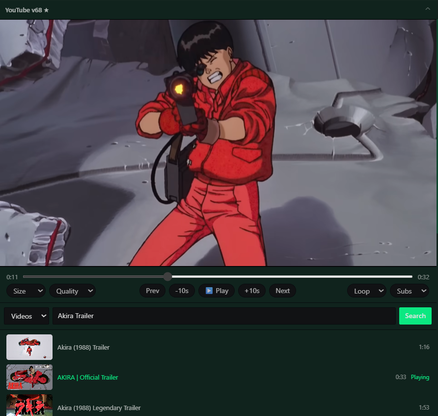
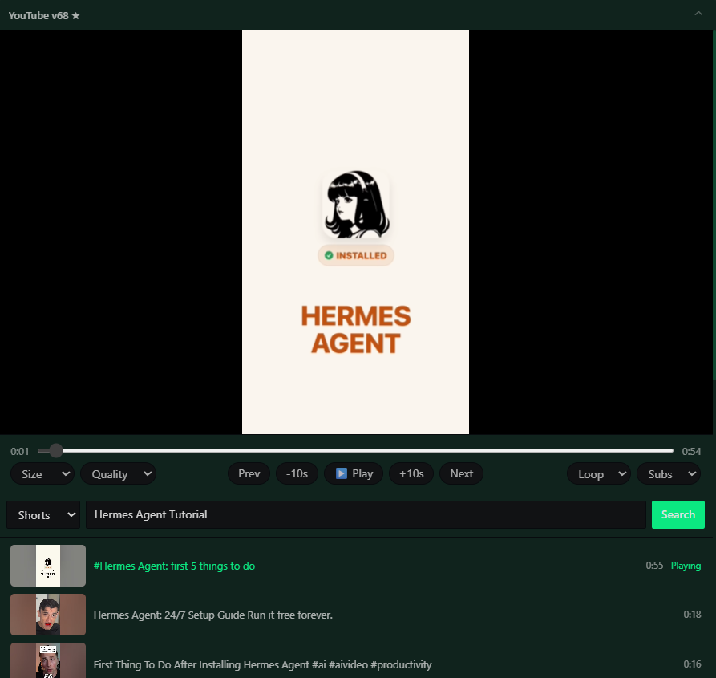
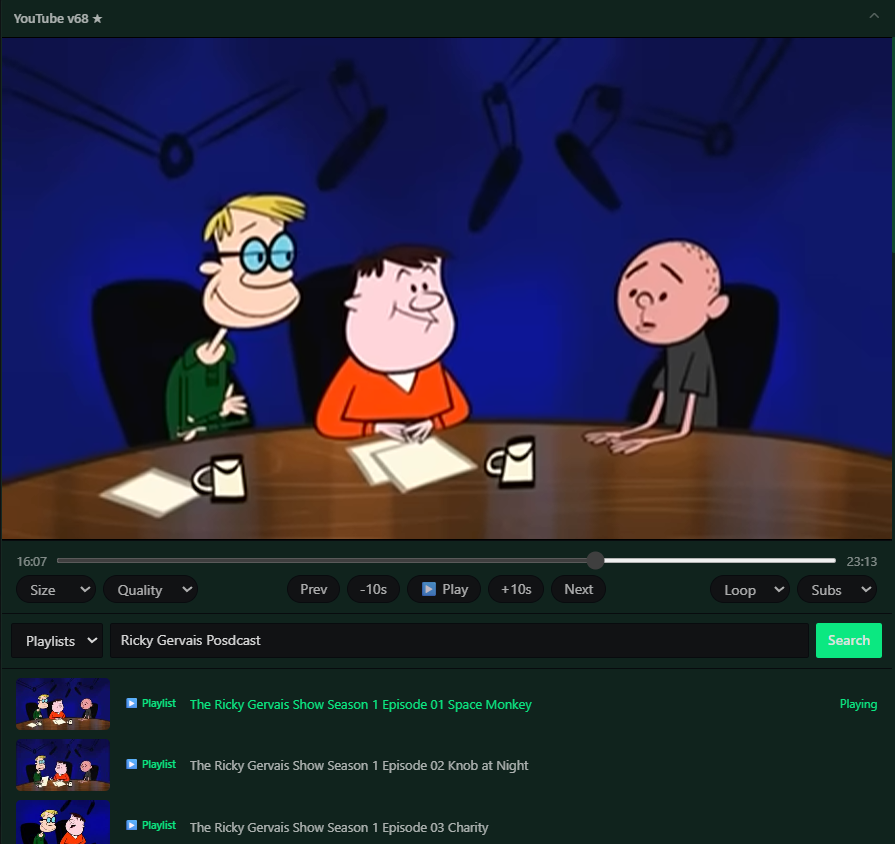

<h1 align="center">Hermes YouTube Player Plugin</h1>

<p align="center">
  A native-style floating YouTube player for <strong>Hermes Desktop</strong> — watch, search, chain Shorts, and play whole playlists without ever leaving your coding workspace.
</p>

<p align="center">
  
  
  
  
</p>

<p align="center">
  
</p>

---

## Demo

The player in action — 26 seconds:

<p align="center">
  
</p>

---

## What it is

A floating desktop pane that brings YouTube straight into Hermes Desktop. It runs YouTube's own real player (not a hacky custom `<video>`), keeps all the transport controls you expect, and adds smart **Videos / Shorts / Playlists** search so you can watch, queue, and binge without tabbing away from your work.

---

## Features

A closer look at what's really under the hood (all backed by the live `plugin.js`):

### 🎬 Real YouTube player
Uses YouTube's own watch-page webview and player API. Because it's YouTube's **real** player — not a repackaged custom `<video>` — playback is full-fidelity with none of the "black frame / audio only" problems that plague scraped-stream players.

### ⌨️ Full transport controls
Everything you need mid-watch, all in one row:
- **`Prev` / `Next`** — previous / next item (respects Shorts & playlist context)
- **`-10s` / `+10s`** — fine-grained scene skip
- **Play / Pause** and a responsive scrubbing **timeline** with live time/duration

### ⚙️ Playback quality
On-the-fly **Quality** selection via YouTube's own quality engine — Auto / 144p / 240p / 360p / 480p / 720p / 1080p — applied directly to the live player.

### 💬 Subtitles & captions
**Subs** control with on/off and automatic caption fallback (built-in + ASR-tracked caption sources), injected as a real `<track>` so they render inside the video.

### 🔁 Loop — off / once / infinite
Three-mode loop with a proper `ended` listener: play once and stop, or loop the clip forever. No drift, no stuck repeats.

### 📺 Search modes: Videos, Shorts, Playlists
Pick a mode, type, and search. Results come straight from YouTube's own data — accurate thumbnails, durations, badges and playlist counts.

### 🕘 Watch history
A **History** mode in the same dropdown shows everything you've played, newest first, persisted across restarts (your last 50 items). Click any row to replay it.

### ⏩ Shorts chaining
Open a Short and the next one plays automatically. **Drift detection** reads the live player's video id and snaps you back if YouTube auto-switches to something you didn't ask for; pausing never advances.

### ▶️ Playlist autostart & playthrough
Click a playlist to load its full episode list, then it **autoplays the first item** and **rolls through to the end** — with an autostart fallback that reloads the proven `/watch?v=<id>&list=…&autoplay=1` path so playback never stalls on a cued-but-unstarted player.

### 📐 Window presets
Fitted **Large / Medium / Small** pane presets that keep the video at a clean 16:9, so the same player fits your layout whether it's a side panel or the main stage.

### 🤖 Ask about what's playing *(roadmap)*
The player knows exactly what's on screen — title, channel, timestamp. A planned upgrade lets Hermes **recognize what you're playing and answer questions about it**, right from the pane.

---

## Screenshots

Search for and play a normal-length video:

<p align="center">
  
</p>

Shorts search &amp; chaining — find a tutorial, play it, let the next one roll:

<p align="center">
  
</p>

Playlists — search, open a playlist, and chain through every episode:

<p align="center">
  
</p>

---

## Install

1. Clone (or download) the repo.
2. From a PowerShell prompt in the repo, run the bundled installer:

```powershell
powershell -ExecutionPolicy Bypass -File .\install-youtube-float-v3.10.ps1
```

3. **Fully quit and reopen Hermes Desktop.** The pane title should show **YouTube v3.10 ★**.

> The installer writes the plugin into both `%LOCALAPPDATA%\hermes\desktop-plugins` and `%USERPROFILE%\.hermes\desktop-plugins`.

---

## What's next

- **Aware playback** — let Hermes recognize the video / channel / timestamp and answer questions about what's on screen.
- More playback-session and queue controls.
- Tighter integration with Hermes chat for "continue the episode", "skip to scene", style commands.

## Development

- `plugin.js` — the entire plugin (ES module, loaded directly by Hermes Desktop).
- `install-youtube-float.ps1` — current installer.
- `docs/versions/` / `CHANGELOG.md` — release history.
- Independent player webview (`persist:hermes-youtube-float-player`) + a hidden search webview; controls drive YouTube's own JS player API.

## License

Apache License 2.0. See [`LICENSE`](LICENSE).