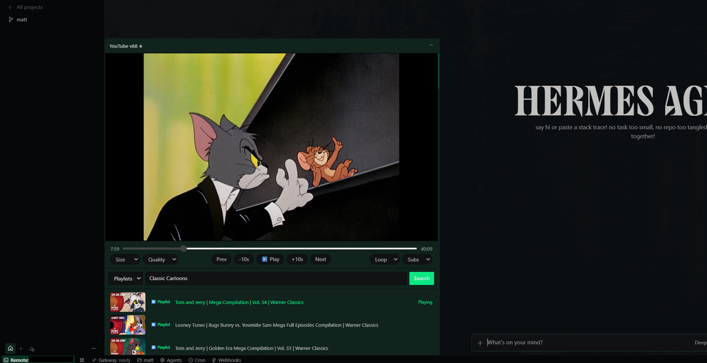
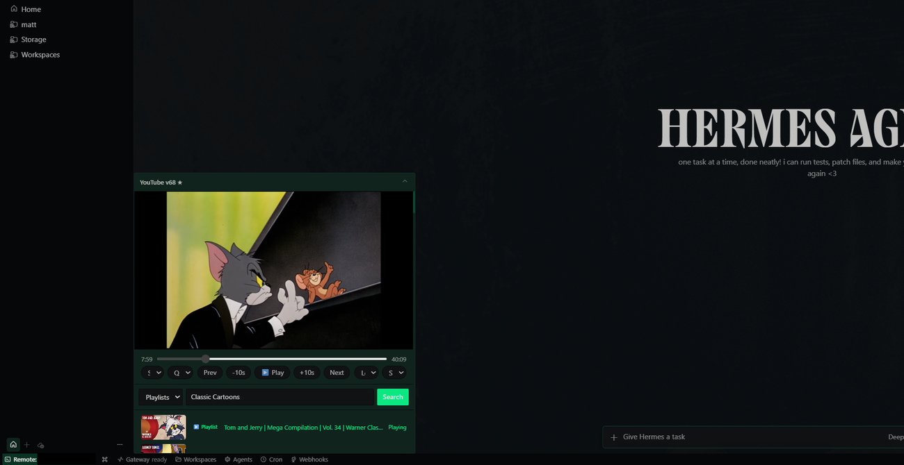
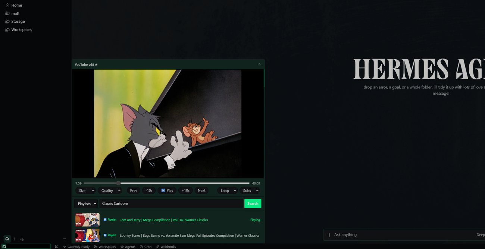

<p align="center">
  
</p>

<h1 align="center">Hermes YouTube Player Plugin</h1>

<p align="center">
  A native-style floating YouTube player for <strong>Hermes Desktop</strong> — watch, search, chain Shorts, and play whole playlists without ever leaving your coding workspace.
</p>

<p align="center">
  
  
  
  
</p>

---

## What it is

A floating desktop pane that brings YouTube straight into Hermes Desktop. It runs YouTube's own real player (not a hacky custom `<video>`), keeps all the transport controls you expect, and adds smart **Videos / Shorts / Playlists** search so you can watch, queue, and grind through content without tabbing away from your work.

Seamless window resizing — the same player, three sizes.

| Small | Medium | Large |
|---|---|---|
|  |  |  |

---

## Features

### 🎬 Real YouTube player
Uses YouTube's own watch-page webview and player API — quality, subtitles, playback speed and loop with none of the "black frame / audio only" nonsense that plagues custom players. The pane sizes to **Large / Medium / Small** presets and keeps video at a clean 16:9.

### ⌨️ Full transport controls
`Prev` · `-10s` · **Play/Pause** · `+10s` · `Next`, plus timeline scrubbing that stays responsive, and Quality / Subs / Loop dropdowns.

### 📺 Search modes: Videos, Shorts, Playlists
Pick a mode, type, and search. Results come straight from YouTube's own data — accurate thumbnails, durations, badges and playlist counts.

### ⏩ Shorts chaining
Open a Short and the next one plays automatically. Drift detection snaps you back if YouTube tries to sneak in something you didn't ask for; pausing never advances.

### 📋 Playlist playthrough
Click a playlist to load its full episode list, then let it **autoplay the first item and roll through to the end** — perfect for a long compilation or a full series binge.

---

## Screenshots

A hero look at the media player mid-video:

<!-- HERO: video search — normal-length non-playlist video (e.g. Akira trailer) -->
<!-- awaiting screenshot -->

Shorts search and play:

<!-- HERO: Shorts search + play of a Hermes tutorial short -->
<!-- awaiting screenshot -->

Playlists — search "Ricky Gervais Podcast", hit the playlist, and let it chain through the episodes:

<p align="center">
  
</p>

---

## Install

1. Clone (or download) the repo.
2. From a PowerShell prompt in the repo, run the bundled installer:

```powershell
powershell -ExecutionPolicy Bypass -File .\install-youtube-float-v3.0.ps1
```

3. **Fully quit and reopen Hermes Desktop.** The pane title should show **YouTube v3.0 ★**.

> The installer writes the plugin into both `%LOCALAPPDATA%\hermes\desktop-plugins` and `%USERPROFILE%\.hermes\desktop-plugins`.

---

## Development

- `plugin.js` — the entire plugin (ES module, loaded directly by Hermes Desktop).
- `install-youtube-float.ps1` — current installer.
- `docs/versions/` / `CHANGELOG.md` — release history.
- Independent player webview (`persist:hermes-youtube-float-player`) + a hidden search webview; controls drive YouTube's own JS player API.

## License

Apache License 2.0. See [`LICENSE`](LICENSE).